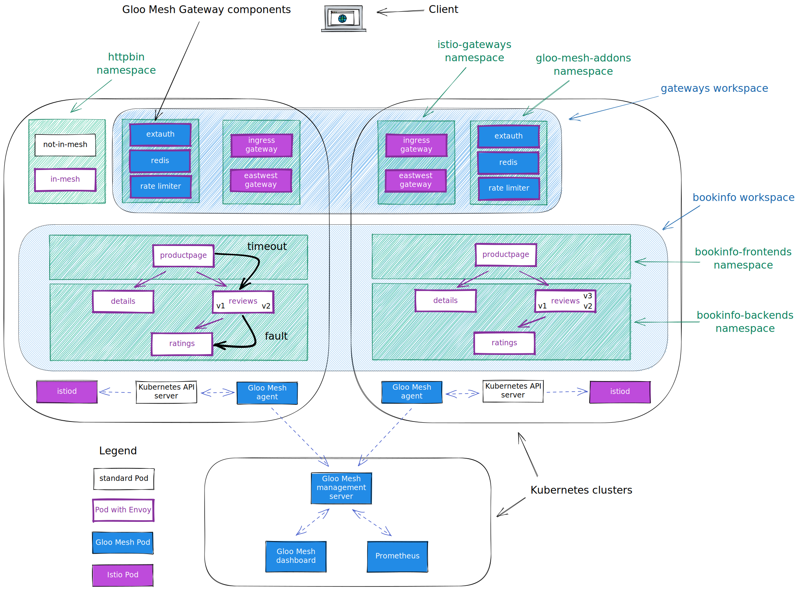
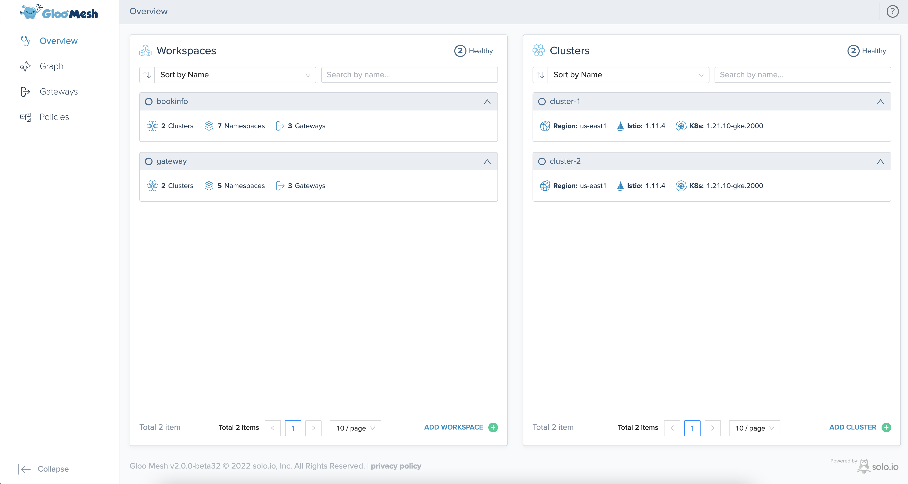

<!--bash
#!/usr/bin/env bash

source ./scripts/assert.sh
-->


# <center>GEHC Gloo Gateway POC Runbook</center>

## Table of Contents
* [Introduction to Gloo Mesh](#introduction)
* [Lab 0 - Prerequisites](#Lab-0)
* [Lab 1 - Setting up your Environment Variables](#Lab-1)
* [Lab 2 - Deploy Istio](#Lab-2)
* [Lab 3 - Deploy the Bookinfo demo app](#Lab-3)
* [Lab 4 - Deploy the httpbin demo app](#Lab-4)
* [Lab 5 - Deploy and register Gloo Mesh](#Lab-5)
* [Lab 6 - Create the gateways workspace](#Lab-6)
* [Lab 7 - Create the bookinfo workspace](#Lab-7)
* [Lab 8a - Expose the productpage through a gateway](#Lab-8a)
* [Lab 8b - Canary deployment with traffic shifting](#Lab-8b)
* [Lab 9 - Traffic policies](#Lab-9)
* [Lab 15 - Exploring the Gloo Mesh Enterprise UI](#Lab-15)

## Introduction to Gloo Mesh <a name="introduction"></a>

[Gloo Mesh Enterprise](https://www.solo.io/products/gloo-mesh/) is a management plane which makes it easy to operate [Istio](https://istio.io) on one or many Kubernetes clusters deployed anywhere (any platform, anywhere).

### Istio support

The Gloo Mesh Enterprise subscription includes end to end Istio support:

- Upstream first
- Specialty builds available (FIPS, ARM, etc)
- Long Term Support (LTS) N-4 
- Critical security patches
- Production break-fix
- One hour SLA Severity 1
- Install / upgrade
- Architecture and operational guidance, best practices

### Gloo Mesh overview

Gloo Mesh provides many unique features, including:

- multi-tenancy based on global workspaces
- zero trust enforcement
- global observability (centralized metrics and access logging)
- simplified cross cluster communications (using virtual destinations)
- advanced gateway capabilities (oauth, jwt, transformations, rate limiting, web application firewall, ...)


## Lab 0 - Prerequisites <a name="Lab-0"></a>

### HIGHLY RECOMMENDED: Read Before Starting the Labs Below:

Before you start running through the Labs below, it is highly recommended to read the About and Concepts sections linked below. Here you will begin to learn the high level value add that Gloo Mesh brings to your Istio architecture. Understanding of the concepts and architecture of Gloo Mesh will help us greatly as we move along the hands-on labs.

[Gloo Mesh Docs - About Gloo Mesh V2](https://docs.solo.io/gloo-mesh-enterprise/main/concepts/about/)

[Gloo Mesh Docs - API Concepts](https://docs.solo.io/gloo-mesh-enterprise/main/concepts/concepts/)

[Gloo Mesh Docs - Relay Architecture](https://docs.solo.io/gloo-mesh-enterprise/main/concepts/relay/)

[Gloo Mesh Docs - Workspaces](https://docs.solo.io/gloo-mesh-enterprise/main/concepts/workspace/)

### Prerequisites
This POC runbook assumes the following:
- 1x clusters deployed on EKS (m5.2xlarge instance size)
- AWS NLB Controller deployed on cluster

## Lab 1 - Setting up your Environment Variables <a name="Lab-1"></a>

Set the GLOO_MESH_LICENSE_KEY environment variable before starting:

```bash
export GLOO_MESH_LICENSE_KEY="<INSERT_LICENSE_KEY_HERE>"
```

Set the context environment variables:

```bash
export MGMT=mgmt
```

You also need to rename the Kubernete contexts of each Kubernetes cluster to match `mgmt`

Here is an example showing how to rename a Kubernetes context:

```
kubectl config rename-context <context to rename> <new context name>
```

Run the following command to make `mgmt` the current cluster.

```bash
kubectl config use-context ${MGMT}
```

> If you prefer to use the existing context name, just set the variables as so:
> ```
> export MGMT=<cluster_mgmt_context>
> ```
>
> Note: these variables may need to be set in each new terminal used


## Lab 2 - Deploy Istio <a name="Lab-2"></a>


We are going to deploy Istio using Helm, but there are several other options. You can find more information in the [Istio documentation](https://istio.io/latest/docs/setup/install/).

First of all, let's Download the Istio release 1.13.4:

```bash
export ISTIO_VERSION=1.13.4
curl -L https://istio.io/downloadIstio | sh -
```

Then, you need to create the `istio-system` and the `istio-gateways` namespaces on the first cluster.

```bash
kubectl --context ${MGMT} create ns istio-system
kubectl --context ${MGMT} create ns istio-gateways
```

Now, let's deploy the Istio control plane on the cluster:

```bash
helm --kube-context=${MGMT} upgrade --install istio-base ./istio-1.13.4/manifests/charts/base -n istio-system

helm --kube-context=${MGMT} upgrade --install istio-1.13.4 ./istio-1.13.4/manifests/charts/istio-control/istio-discovery -n istio-system --values - <<EOF
revision: 1-13
global:
  meshID: mesh1
  multiCluster:
    clusterName: mgmt
  network: network1
  hub: us-docker.pkg.dev/gloo-mesh/istio-workshops
  tag: 1.13.4-solo
meshConfig:
  trustDomain: mgmt
  accessLogFile: /dev/stdout
  enableAutoMtls: true
  defaultConfig:
    envoyMetricsService:
      address: gloo-mesh-agent.gloo-mesh:9977
    envoyAccessLogService:
      address: gloo-mesh-agent.gloo-mesh:9977
    proxyMetadata:
      ISTIO_META_DNS_CAPTURE: "true"
      ISTIO_META_DNS_AUTO_ALLOCATE: "true"
      GLOO_MESH_CLUSTER_NAME: mgmt
pilot:
  env:
    PILOT_ENABLE_K8S_SELECT_WORKLOAD_ENTRIES: "false"
    PILOT_SKIP_VALIDATE_TRUST_DOMAIN: "true"
EOF
```

After that, you can deploy the gateway(s):

```bash
kubectl --context ${MGMT} label namespace istio-gateways istio.io/rev=1-13

helm --kube-context=${MGMT} upgrade --install istio-ingressgateway ./istio-1.13.4/manifests/charts/gateways/istio-ingress -n istio-gateways --values - <<EOF
global:
  hub: us-docker.pkg.dev/gloo-mesh/istio-workshops
  tag: 1.13.4-solo
gateways:
  istio-ingressgateway:
    name: istio-ingressgateway
    namespace: istio-gateways
    labels:
      istio: ingressgateway
    injectionTemplate: gateway
    type: LoadBalancer
    ports:
    - name: http2
      port: 80
      targetPort: 8080
    - name: https
      port: 443
      targetPort: 8443
    serviceAnnotations:
      meta.helm.sh/release-name: istio-ingressgateway
      meta.helm.sh/release-namespace: istio-gateways
      service.beta.kubernetes.io/aws-load-balancer-backend-protocol: TCP
      service.beta.kubernetes.io/aws-load-balancer-healthcheck-healthy-threshold: "2"
      service.beta.kubernetes.io/aws-load-balancer-healthcheck-interval: "10"
      service.beta.kubernetes.io/aws-load-balancer-healthcheck-port: "15021"
      service.beta.kubernetes.io/aws-load-balancer-healthcheck-protocol: tcp
      service.beta.kubernetes.io/aws-load-balancer-healthcheck-unhealthy-threshold: "2"
      service.beta.kubernetes.io/aws-load-balancer-nlb-target-type: ip
      service.beta.kubernetes.io/aws-load-balancer-scheme: internet-facing
      service.beta.kubernetes.io/aws-load-balancer-type: external
EOF

helm --kube-context=${MGMT} upgrade --install istio-eastwestgateway ./istio-1.13.4/manifests/charts/gateways/istio-ingress -n istio-gateways --values - <<EOF
global:
  hub: us-docker.pkg.dev/gloo-mesh/istio-workshops
  tag: 1.13.4-solo
gateways:
  istio-ingressgateway:
    name: istio-eastwestgateway
    namespace: istio-gateways
    labels:
      istio: eastwestgateway
      topology.istio.io/network: network1
    injectionTemplate: gateway
    type: LoadBalancer
    ports:
    - name: tcp-status-port
      port: 15021
      targetPort: 15021
    - name: tls
      port: 15443
      targetPort: 15443
    - name: tcp-istiod
      port: 15012
      targetPort: 15012
    - name: tcp-webhook
      port: 15017
      targetPort: 15017
    serviceAnnotations:
      meta.helm.sh/release-name: istio-ingressgateway
      meta.helm.sh/release-namespace: istio-gateways
      service.beta.kubernetes.io/aws-load-balancer-backend-protocol: TCP
      service.beta.kubernetes.io/aws-load-balancer-healthcheck-healthy-threshold: "2"
      service.beta.kubernetes.io/aws-load-balancer-healthcheck-interval: "10"
      service.beta.kubernetes.io/aws-load-balancer-healthcheck-port: "15021"
      service.beta.kubernetes.io/aws-load-balancer-healthcheck-protocol: tcp
      service.beta.kubernetes.io/aws-load-balancer-healthcheck-unhealthy-threshold: "2"
      service.beta.kubernetes.io/aws-load-balancer-nlb-target-type: ip
      service.beta.kubernetes.io/aws-load-balancer-scheme: internet-facing
      service.beta.kubernetes.io/aws-load-balancer-type: external
    env:
      ISTIO_META_ROUTER_MODE: "sni-dnat"
      ISTIO_META_REQUESTED_NETWORK_VIEW: "network1"
EOF
```

As you can see, we deploy the control plane (istiod) in the `istio-system` and gateway(s) in the `istio-gateways` namespace.

One gateway will be used for ingress traffic while the other one will be used for cross cluster communications. It's not mandatory to use separate gateways, but it's a best practice.

Note that we set the `trust domain` to be the same as the cluster name and we configure the sidecars to send their metrics and access logs to the Gloo Mesh agent.

Run the following command until all the Istio Pods are ready:

```bash
kubectl --context ${MGMT} get pods -n istio-system && kubectl --context ${MGMT} get pods -n istio-gateways
```

When they are ready, you should get this output:

```
NAME                      READY   STATUS    RESTARTS   AGE
istiod-5c669bcf6f-2hn6c   1/1     Running   0          3m7s
NAME                                     READY   STATUS    RESTARTS   AGE
istio-eastwestgateway-77f79cdb47-f4r7k   1/1     Running   0          2m53s
istio-ingressgateway-744fcf4fb-5dc7q     1/1     Running   0          2m44s
```

Set the environment variable for the service corresponding to the Istio Ingress Gateway of the cluster(s):

```bash
export ENDPOINT_HTTP_GW_MGMT=$(kubectl --context ${MGMT} -n istio-gateways get svc istio-ingressgateway -o jsonpath='{.status.loadBalancer.ingress[0].*}'):80
export ENDPOINT_HTTPS_GW_MGMT=$(kubectl --context ${MGMT} -n istio-gateways get svc istio-ingressgateway -o jsonpath='{.status.loadBalancer.ingress[0].*}'):443
export HOST_GW_MGMT=$(echo ${ENDPOINT_HTTP_GW_MGMT} | cut -d: -f1)
```

## Lab 3 - Deploy the Bookinfo demo app <a name="Lab-3"></a>

We're going to deploy the bookinfo application to demonstrate several features of Istio and Gloo Mesh.

You can find more information about this application [here](https://istio.io/latest/docs/examples/bookinfo/).

Run the following commands to deploy the bookinfo application on `mgmt`:

```bash
kubectl --context ${MGMT} create ns bookinfo-frontends
kubectl --context ${MGMT} create ns bookinfo-backends
curl https://raw.githubusercontent.com/istio/istio/release-1.13/samples/bookinfo/platform/kube/bookinfo.yaml > bookinfo.yaml
kubectl --context ${MGMT} label namespace bookinfo-frontends istio.io/rev=1-13
kubectl --context ${MGMT} label namespace bookinfo-backends istio.io/rev=1-13
# deploy the frontend bookinfo service in the bookinfo-frontends namespace
kubectl --context ${MGMT} -n bookinfo-frontends apply -f bookinfo.yaml -l 'account in (productpage)'
kubectl --context ${MGMT} -n bookinfo-frontends apply -f bookinfo.yaml -l 'app in (productpage)'
# deploy the backend bookinfo services in the bookinfo-backends namespace for all versions less than v3
kubectl --context ${MGMT} -n bookinfo-backends apply -f bookinfo.yaml -l 'account in (reviews,ratings,details)'
kubectl --context ${MGMT} -n bookinfo-backends apply -f bookinfo.yaml -l 'app in (reviews,ratings,details),version notin (v3)'
# Update the productpage deployment to set the environment variables to define where the backend services are running
kubectl --context ${MGMT} -n bookinfo-frontends set env deploy/productpage-v1 DETAILS_HOSTNAME=details.bookinfo-backends.svc.cluster.local
kubectl --context ${MGMT} -n bookinfo-frontends set env deploy/productpage-v1 REVIEWS_HOSTNAME=reviews.bookinfo-backends.svc.cluster.local
# Update the reviews service to display where it is coming from
kubectl --context ${MGMT} -n bookinfo-backends set env deploy/reviews-v1 CLUSTER_NAME=${MGMT}
kubectl --context ${MGMT} -n bookinfo-backends set env deploy/reviews-v2 CLUSTER_NAME=${MGMT}
```

You can check that the app is running using the following command:

```
kubectl --context ${MGMT} -n bookinfo-frontends get pods && kubectl --context ${MGMT} -n bookinfo-backends get pods
```

```
NAME                              READY   STATUS    RESTARTS   AGE
productpage-v1-7654c7546b-7kztp   2/2     Running   0          32m
NAME                          READY   STATUS    RESTARTS   AGE
details-v1-5498c86cf5-tx9f9   2/2     Running   0          32m
ratings-v1-b477cf6cf-fk5rv    2/2     Running   0          32m
reviews-v1-79d546878f-kcc25   2/2     Running   0          32m
reviews-v2-548c57f459-8xh7n   2/2     Running   0          32m
```

Note that we deployed the `productpage` service in the `bookinfo-frontends` namespace and the other services in the `bookinfo-backends` namespace.

And we deployed the `v1` and `v2` versions of the `reviews` microservice, not the `v3` version.

## Lab 4 - Deploy the httpbin demo app <a name="Lab-4"></a>

We're going to deploy the httpbin application to demonstrate several features of Istio and Gloo Mesh.

You can find more information about this application [here](http://httpbin.org/).

Run the following commands to deploy the httpbin app on `mgmt` twice.

The first version will be called `not-in-mesh` and won't have the sidecar injected (because we don't label the namespace).

```bash
kubectl --context ${MGMT} create ns httpbin

kubectl --context ${MGMT} apply -n httpbin -f - <<EOF
apiVersion: v1
kind: ServiceAccount
metadata:
  name: not-in-mesh
---
apiVersion: v1
kind: Service
metadata:
  name: not-in-mesh
  labels:
    app: not-in-mesh
    service: not-in-mesh
spec:
  ports:
  - name: http
    port: 8000
    targetPort: 80
  selector:
    app: not-in-mesh
---
apiVersion: apps/v1
kind: Deployment
metadata:
  name: not-in-mesh
spec:
  replicas: 1
  selector:
    matchLabels:
      app: not-in-mesh
      version: v1
  template:
    metadata:
      labels:
        app: not-in-mesh
        version: v1
    spec:
      serviceAccountName: not-in-mesh
      containers:
      - image: docker.io/kennethreitz/httpbin
        imagePullPolicy: IfNotPresent
        name: not-in-mesh
        ports:
        - containerPort: 80
EOF
```

The second version will be called `in-mesh` and will have the sidecar injected (because of the label `istio.io/rev` in the Pod template).

```bash
kubectl --context ${MGMT} apply -n httpbin -f - <<EOF
apiVersion: v1
kind: ServiceAccount
metadata:
  name: in-mesh
---
apiVersion: v1
kind: Service
metadata:
  name: in-mesh
  labels:
    app: in-mesh
    service: in-mesh
spec:
  ports:
  - name: http
    port: 8000
    targetPort: 80
  selector:
    app: in-mesh
---
apiVersion: apps/v1
kind: Deployment
metadata:
  name: in-mesh
spec:
  replicas: 1
  selector:
    matchLabels:
      app: in-mesh
      version: v1
  template:
    metadata:
      labels:
        app: in-mesh
        version: v1
        istio.io/rev: 1-13
    spec:
      serviceAccountName: in-mesh
      containers:
      - image: docker.io/kennethreitz/httpbin
        imagePullPolicy: IfNotPresent
        name: in-mesh
        ports:
        - containerPort: 80
EOF
```

You can check that the app is running using

```
kubectl --context ${MGMT} -n httpbin get pods
```

```
NAME                           READY   STATUS    RESTARTS   AGE
in-mesh-5d9d9549b5-qrdgd       2/2     Running   0          11s
not-in-mesh-5c64bb49cd-m9kwm   1/1     Running   0          11s
```

## Lab 5 - Deploy and register Gloo Mesh <a name="Lab-5"></a>

First of all, let's install the `meshctl` CLI:

```bash
export GLOO_MESH_VERSION=v2.0.9
curl -sL https://run.solo.io/meshctl/install | sh -
export PATH=$HOME/.gloo-mesh/bin:$PATH
```

Run the following commands to deploy the Gloo Mesh management plane:

```bash
helm repo add gloo-mesh-enterprise https://storage.googleapis.com/gloo-mesh-enterprise/gloo-mesh-enterprise 
helm repo update
kubectl --context ${MGMT} create ns gloo-mesh 
helm upgrade --install gloo-mesh-enterprise gloo-mesh-enterprise/gloo-mesh-enterprise \
--namespace gloo-mesh --kube-context ${MGMT} \
--version=2.0.9 \
--values - <<EOF
licenseKey: "${GLOO_MESH_LICENSE_KEY}"
mgmtClusterName: mgmt
glooMeshMgmtServer:
  resources:
    requests:
      cpu: 125m
      memory: 256Mi
    limits:
      cpu: 1000m
      memory: 1Gi
  ports:
    healthcheck: 8091
    grpc: 9900
  serviceType: LoadBalancer
  # Additional settings to add to the load balancer service
  serviceOverrides:
    metadata:
      annotations:
        # AWS-specific annotations
        service.beta.kubernetes.io/aws-load-balancer-healthcheck-healthy-threshold: "2"
        service.beta.kubernetes.io/aws-load-balancer-healthcheck-unhealthy-threshold: "2"
        service.beta.kubernetes.io/aws-load-balancer-healthcheck-interval: "10"
        service.beta.kubernetes.io/aws-load-balancer-healthcheck-port: "9900"
        service.beta.kubernetes.io/aws-load-balancer-healthcheck-protocol: "tcp"
        service.beta.kubernetes.io/aws-load-balancer-type: external
        service.beta.kubernetes.io/aws-load-balancer-scheme: internet-facing
        service.beta.kubernetes.io/aws-load-balancer-nlb-target-type: ip
        service.beta.kubernetes.io/aws-load-balancer-backend-protocol: TCP
        service.beta.kubernetes.io/aws-load-balancer-name: solo-poc-gloo-mesh-mgmt-server
  relay:
    disableCA: false
    disableCACertGeneration: false
glooMeshUi:
  resources:
    requests:
      cpu: 125m
      memory: 256Mi
    limits:
      cpu: 500m
      memory: 512Gi
rbac-webhook:
  enabled: false
glooMeshRedis:
  resources:
    requests:
      cpu: 125m
      memory: 256Mi
    limits:
      cpu: 500m
      memory: 512Gi
prometheus:
  enabled: true
  server:
    resources:
      requests:
        cpu: 125m
        memory: 256Mi
      limits:
        cpu: 500m
        memory: 512Gi
EOF

kubectl --context ${MGMT} -n gloo-mesh rollout status deploy/gloo-mesh-mgmt-server
```

Then, you need to set the environment variable to tell the Gloo Mesh agents how to communicate with the management plane:

```bash
export ENDPOINT_GLOO_MESH=$(kubectl --context ${MGMT} -n gloo-mesh get svc gloo-mesh-mgmt-server -o jsonpath='{.status.loadBalancer.ingress[0].*}'):9900
export HOST_GLOO_MESH=$(echo ${ENDPOINT_GLOO_MESH} | cut -d: -f1)
```

Check that the variables have correct values:
```
echo $HOST_GLOO_MESH
echo $ENDPOINT_GLOO_MESH
```

Finally, you need to register the cluster(s).

Here is how you register:

```bash
helm repo add gloo-mesh-agent https://storage.googleapis.com/gloo-mesh-enterprise/gloo-mesh-agent
helm repo update

kubectl apply --context ${MGMT} -f- <<EOF
apiVersion: admin.gloo.solo.io/v2
kind: KubernetesCluster
metadata:
  name: mgmt
  namespace: gloo-mesh
spec:
  clusterDomain: cluster.local
EOF

kubectl --context ${MGMT} create ns gloo-mesh

kubectl get secret relay-root-tls-secret -n gloo-mesh --context ${MGMT} -o jsonpath='{.data.ca\.crt}' | base64 -d > ca.crt
kubectl create secret generic relay-root-tls-secret -n gloo-mesh --context ${MGMT} --from-file ca.crt=ca.crt
rm ca.crt

kubectl get secret relay-identity-token-secret -n gloo-mesh --context ${MGMT} -o jsonpath='{.data.token}' | base64 -d > token
kubectl create secret generic relay-identity-token-secret -n gloo-mesh --context ${MGMT} --from-file token=token
rm token

helm upgrade --install gloo-mesh-agent gloo-mesh-agent/gloo-mesh-agent \
  --namespace gloo-mesh \
  --kube-context=${MGMT} \
  --set relay.serverAddress=${ENDPOINT_GLOO_MESH} \
  --set relay.authority=gloo-mesh-mgmt-server.gloo-mesh \
  --set rate-limiter.enabled=false \
  --set ext-auth-service.enabled=false \
  --set cluster=mgmt \
  --version 2.0.9
```

Note that the registration can also be performed using `meshctl cluster register`.

You can check the cluster(s) have been registered correctly using the following commands:

```
pod=$(kubectl --context ${MGMT} -n gloo-mesh get pods -l app=gloo-mesh-mgmt-server -o jsonpath='{.items[0].metadata.name}')
kubectl --context ${MGMT} -n gloo-mesh debug -q -i ${pod} --image=curlimages/curl -- curl -s http://localhost:9091/metrics | grep relay_push_clients_connected
```

You should get an output similar to this:

```
# HELP relay_push_clients_connected Current number of connected Relay push clients (Relay Agents).
# TYPE relay_push_clients_connected gauge
relay_push_clients_connected{cluster="mgmt"} 1
relay_push_clients_connected{cluster="cluster2"} 1
```

To use the Gloo Mesh Gateway advanced features (external authentication, rate limiting, ...), you need to install the Gloo Mesh addons.

First, you need to create a namespace for the addons, with Istio injection enabled:

```bash
kubectl --context ${MGMT} create namespace gloo-mesh-addons
kubectl --context ${MGMT} label namespace gloo-mesh-addons istio.io/rev=1-13
```

Then, you can deploy the addons on the cluster(s) using Helm:

```bash
helm upgrade --install gloo-mesh-agent-addons gloo-mesh-agent/gloo-mesh-agent \
  --namespace gloo-mesh-addons \
  --kube-context=${MGMT} \
  --set glooMeshAgent.enabled=false \
  --set rate-limiter.enabled=true \
  --set ext-auth-service.enabled=true \
  --version 2.0.9
```

Finally, you need to specify which gateways you want to use for cross cluster traffic:

```bash
cat <<EOF | kubectl --context ${MGMT} apply -f -
apiVersion: admin.gloo.solo.io/v2
kind: WorkspaceSettings
metadata:
  name: global
  namespace: gloo-mesh
spec:
  options:
    eastWestGateways:
      - selector:
          labels:
            istio: eastwestgateway
EOF
```

This is how to environment looks like now:


## Lab 6 - Create the gateways workspace <a name="Lab-6"></a>

We're going to create a workspace for the team in charge of the Gateways.

The platform team needs to create the corresponding `Workspace` Kubernetes objects in the Gloo Mesh management cluster.

Let's create the `gateways` workspace which corresponds to the `istio-gateways` and the `gloo-mesh-addons` namespaces on the cluster(s):

```bash
kubectl apply --context ${MGMT} -f- <<EOF
apiVersion: admin.gloo.solo.io/v2
kind: Workspace
metadata:
  name: gateways
  namespace: gloo-mesh
spec:
  workloadClusters:
  - name: mgmt
    namespaces:
    - name: istio-gateways
    - name: gloo-mesh-addons
EOF
```

Then, the Gateway team creates a `WorkspaceSettings` Kubernetes object in one of the namespaces of the `gateways` workspace (so the `istio-gateways` or the `gloo-mesh-addons` namespace):

```bash
kubectl apply --context ${MGMT} -f- <<EOF
apiVersion: admin.gloo.solo.io/v2
kind: WorkspaceSettings
metadata:
  name: gateways
  namespace: istio-gateways
spec:
  importFrom:
  - workspaces:
    - selector:
        allow_ingress: "true"
    resources:
    - kind: SERVICE
    - kind: ALL
      labels:
        expose: "true"
  exportTo:
  - workspaces:
    - selector:
        allow_ingress: "true"
    resources:
    - kind: SERVICE
EOF
```

The Gateway team has decided to import the following from the workspaces that have the label `allow_ingress` set to `true` (using a selector):
- all the Kubernetes services exported by these workspaces
- all the resources (RouteTables, VirtualDestination, ...) exported by these workspaces that have the label `expose` set to `true`


## Lab 7 - Create the bookinfo workspace <a name="Lab-7"></a>

We're going to create a workspace for the team in charge of the Bookinfo application.

The platform team needs to create the corresponding `Workspace` Kubernetes objects in the Gloo Mesh management cluster.

Let's create the `bookinfo` workspace which corresponds to the `bookinfo-frontends` and `bookinfo-backends` namespaces on the cluster(s):

```bash
kubectl apply --context ${MGMT} -f- <<EOF
apiVersion: admin.gloo.solo.io/v2
kind: Workspace
metadata:
  name: bookinfo
  namespace: gloo-mesh
  labels:
    allow_ingress: "true"
spec:
  workloadClusters:
  - name: mgmt
    namespaces:
    - name: bookinfo-frontends
    - name: bookinfo-backends
EOF
```

Then, the Bookinfo team creates a `WorkspaceSettings` Kubernetes object in one of the namespaces of the `bookinfo` workspace (so the `bookinfo-frontends` or the `bookinfo-backends` namespace):

```bash
kubectl apply --context ${MGMT} -f- <<EOF
apiVersion: admin.gloo.solo.io/v2
kind: WorkspaceSettings
metadata:
  name: bookinfo
  namespace: bookinfo-frontends
spec:
  importFrom:
  - workspaces:
    - name: gateways
    resources:
    - kind: SERVICE
  exportTo:
  - workspaces:
    - name: gateways
    resources:
    - kind: SERVICE
      labels:
        app: productpage
    - kind: SERVICE
      labels:
        app: reviews
    - kind: ALL
      labels:
        expose: "true"
EOF
```

The Bookinfo team has decided to export the following to the `gateway` workspace (using a reference):
- the `productpage` and the `reviews` Kubernetes services
- all the resources (RouteTables, VirtualDestination, ...) that have the label `expose` set to `true`

This is how to environment looks like with the workspaces:


## Lab 8a - Expose the productpage through a gateway <a name="Lab-8a"></a>

In this step, we're going to expose the `productpage` service through the Ingress Gateway using Gloo Mesh.

The Gateway team must create a `VirtualGateway` to configure the Istio Ingress Gateway in mgmt to listen to incoming requests.

```bash
kubectl --context ${MGMT} apply -f - <<EOF
apiVersion: networking.gloo.solo.io/v2
kind: VirtualGateway
metadata:
  name: north-south-gw
  namespace: istio-gateways
spec:
  workloads:
    - selector:
        labels:
          istio: ingressgateway
        cluster: mgmt
  listeners: 
    - http: {}
      port:
        number: 80
      allowedRouteTables:
        - host: '*'
EOF
```

Then, the Bookinfo team can create a `RouteTable` to determine how they want to handle the traffic.

```bash
kubectl --context ${MGMT} apply -f - <<EOF
apiVersion: networking.gloo.solo.io/v2
kind: RouteTable
metadata:
  name: productpage
  namespace: bookinfo-frontends
  labels:
    expose: "true"
spec:
  hosts:
    - '*'
  virtualGateways:
    - name: north-south-gw
      namespace: istio-gateways
      cluster: mgmt
  workloadSelectors: []
  http:
    - name: productpage
      matchers:
      - uri:
          exact: /productpage
      - uri:
          prefix: /static
      - uri:
          exact: /login
      - uri:
          exact: /logout
      - uri:
          prefix: /api/v1/products
      forwardTo:
        destinations:
          - ref:
              name: productpage
              namespace: bookinfo-frontends
            port:
              number: 9080
EOF
```

You should now be able to access the `productpage` application through the browser.

Get the URL to access the `productpage` service using the following command:
```
echo "http://${ENDPOINT_HTTP_GW_MGMT}/productpage"
```

Gloo Mesh translates the `VirtualGateway` and `RouteTable` into the corresponding Istio objects (`Gateway` and `VirtualService`).

Now, let's secure the access through TLS.

Let's first create a private key and a self-signed certificate:

```bash
openssl req -x509 -nodes -days 365 -newkey rsa:2048 \
   -keyout tls.key -out tls.crt -subj "/CN=*"
```

Then, you have to store them in a Kubernetes secrets running the following commands:

```bash
kubectl --context ${MGMT} -n istio-gateways create secret generic tls-secret \
--from-file=tls.key=tls.key \
--from-file=tls.crt=tls.crt

kubectl --context ${CLUSTER2} -n istio-gateways create secret generic tls-secret \
--from-file=tls.key=tls.key \
--from-file=tls.crt=tls.crt
```

Finally, the Gateway team needs to update the `VirtualGateway` to use this secret:

```bash
kubectl --context ${MGMT} apply -f - <<EOF
apiVersion: networking.gloo.solo.io/v2
kind: VirtualGateway
metadata:
  name: north-south-gw
  namespace: istio-gateways
spec:
  workloads:
    - selector:
        labels:
          istio: ingressgateway
        cluster: mgmt
  listeners: 
    - http: {}
# ---------------- SSL config ---------------------------
      port:
        number: 443
      tls:
        mode: SIMPLE
        secretName: tls-secret
# -------------------------------------------------------
      allowedRouteTables:
        - host: '*'
EOF
```

You can now access the `productpage` application securely through the browser.
Get the URL to access the `productpage` service using the following command:
```
echo "https://${ENDPOINT_HTTPS_GW_MGMT}/productpage"
```

This diagram shows the flow of the request (through the Istio Ingress Gateway):


## Lab 8b - Canary deployment with traffic shifting <a name="Lab-8b"></a>

Let's explore weighted destinations and how we can use them to demonstrate basic functionality of canary deployments. Leveraging weighted destinations, we can start to build up foundations of progressive delivery techniques

Take note that our current deployment does not have any weights defined. This will result in a round-robin behavior across the existing reviews services in mgmt. You will notice that v1 (no stars) and v2 (black stars) reviews services. 

Let's assume that the v2 reviews service is a newly developed application. Round robin in this case may not be desirable in this situation since we may still be testing the functionality of the "new" v2 service in our cluster. A good strategy we can leverage to carefully release the v2 service is canary/progressive delivery.

Here we will create a new RouteTable that will allow us to define weights for our reviews service so that I can control the flow of traffic to each subset. Let's start by setting 100% of the weight to the v1 service. 

```bash
kubectl --context ${MGMT} apply -f - <<EOF
apiVersion: networking.gloo.solo.io/v2
kind: RouteTable
metadata:
  name: reviews
  namespace: bookinfo-backends
spec:
  hosts:
  - reviews.bookinfo-backends.svc.cluster.local
  http:
  - forwardTo:
      destinations:
      - port:
          number: 9080
        ref:
          cluster: mgmt
          name: reviews
          namespace: bookinfo-backends
        subset:
          version: v1
        weight: 100
      - port:
          number: 9080
        ref:
          cluster: mgmt
          name: reviews
          namespace: bookinfo-backends
        subset:
          version: v2
        weight: 0
    matchers:
    - uri:
        prefix: /
    name: reviews
  workloadSelectors:
  - selector:
      labels:
        app: productpage
EOF
```

If you navigate back to your bookinfo application, what we should observe is that only v1 reviews service is available (no stars)

Great! Now lets slowly shift traffic to our newly created v2 service and observe the behavior for correctness. Typically you can do this progressively to ensure low impact in case of an issue such as a 20-40-60-80-100 weighted strategy. For this lab we will just progressively shift to v2 50/50, and then 100% v2

```bash
kubectl --context ${MGMT} apply -f - <<EOF
apiVersion: networking.gloo.solo.io/v2
kind: RouteTable
metadata:
  name: reviews
  namespace: bookinfo-backends
spec:
  hosts:
  - reviews.bookinfo-backends.svc.cluster.local
  http:
  - forwardTo:
      destinations:
      - port:
          number: 9080
        ref:
          cluster: mgmt
          name: reviews
          namespace: bookinfo-backends
        subset:
          version: v1
        weight: 50
      - port:
          number: 9080
        ref:
          cluster: mgmt
          name: reviews
          namespace: bookinfo-backends
        subset:
          version: v2
        weight: 50
    matchers:
    - uri:
        prefix: /
    name: reviews
  workloadSelectors:
  - selector:
      labels:
        app: productpage
EOF
```

If you navigate back to your bookinfo application, what we should observe is v1 and v2 reviews service are served 50% of the time

Now that we feel confident that v2 reviews service will work, we can shift traffic completely to v2 (black stars)

```bash
kubectl --context ${MGMT} apply -f - <<EOF
apiVersion: networking.gloo.solo.io/v2
kind: RouteTable
metadata:
  name: reviews
  namespace: bookinfo-backends
spec:
  hosts:
  - reviews.bookinfo-backends.svc.cluster.local
  http:
  - forwardTo:
      destinations:
      - port:
          number: 9080
        ref:
          cluster: mgmt
          name: reviews
          namespace: bookinfo-backends
        subset:
          version: v1
        weight: 0
      - port:
          number: 9080
        ref:
          cluster: mgmt
          name: reviews
          namespace: bookinfo-backends
        subset:
          version: v2
        weight: 100
    matchers:
    - uri:
        prefix: /
    name: reviews
  workloadSelectors:
  - selector:
      labels:
        app: productpage
EOF
```

If you navigate back to your bookinfo application, what we should observe v2 reviews service is served 100% of the time

We have now successfully transitioned our v1 app to the v2 canary!

Let's delete the `RouteTable` we've created to move forward with the next labs:
```bash
kubectl --context ${MGMT} -n bookinfo-backends delete routetable reviews
```

## Lab 9 - Traffic policies <a name="Lab-9"></a>

We're going to use Gloo Mesh policies to inject faults and configure timeouts.

Let's create the following `FaultInjectionPolicy` to inject a delay when the `v2` version of the `reviews` service talk to the `ratings` service:

```bash
cat << EOF | kubectl --context ${MGMT} apply -f -
apiVersion: resilience.policy.gloo.solo.io/v2
kind: FaultInjectionPolicy
metadata:
  name: ratings-fault-injection
  namespace: bookinfo-backends
spec:
  applyToRoutes:
  - route:
      labels:
        fault_injection: "true"
  config:
    delay:
      fixedDelay: 2s
      percentage: 100
EOF
```

As you can see, it will be applied to all the routes that have the label `fault_injection` set to `"true"`.

So, you need to create a `RouteTable` with this label set in the corresponding route.

```bash
cat << EOF | kubectl --context ${MGMT} apply -f -
apiVersion: networking.gloo.solo.io/v2
kind: RouteTable
metadata:
  name: ratings
  namespace: bookinfo-backends
spec:
  hosts:
    - 'ratings.bookinfo-backends.svc.cluster.local'
  workloadSelectors:
  - selector:
      labels:
        app: reviews
  http:
    - name: ratings
      labels:
        fault_injection: "true"
      matchers:
      - uri:
          prefix: /
      forwardTo:
        destinations:
          - ref:
              name: ratings
              namespace: bookinfo-backends
            port:
              number: 9080
EOF
```

If you refresh the webpage, you should see that it takes longer to get the `productpage` loaded when version `v2` of the `reviews` services is called.

Now, let's configure a 0.5s request timeout when the `productpage` service calls the `reviews` service on mgmt.

You need to create the following `RetryTimeoutPolicy`:

```bash
cat << EOF | kubectl --context ${MGMT} apply -f -
apiVersion: resilience.policy.gloo.solo.io/v2
kind: RetryTimeoutPolicy
metadata:
  name: reviews-request-timeout
  namespace: bookinfo-backends
spec:
  applyToRoutes:
  - route:
      labels:
        request_timeout: "0.5s"
  config:
    requestTimeout: 0.5s
EOF
```

As you can see, it will be applied to all the routes that have the label `request_timeout` set to `"0.5s"`.

Then, you need to create a `RouteTable` with this label set in the corresponding route.

```bash
cat << EOF | kubectl --context ${MGMT} apply -f -
apiVersion: networking.gloo.solo.io/v2
kind: RouteTable
metadata:
  name: reviews
  namespace: bookinfo-backends
spec:
  hosts:
    - 'reviews.bookinfo-backends.svc.cluster.local'
  workloadSelectors:
  - selector:
      labels:
        app: productpage
  http:
    - name: reviews
      labels:
        request_timeout: "0.5s"
      matchers:
      - uri:
          prefix: /
      forwardTo:
        destinations:
          - ref:
              name: reviews
              namespace: bookinfo-backends
            port:
              number: 9080
            subset:
              version: v2
EOF
```

If you refresh the page several times, you'll see an error message telling that reviews are unavailable when the productpage is trying to communicate with the version `v2` of the `reviews` service.


This diagram shows where the timeout and delay have been applied:



Let's delete the Gloo Mesh objects we've created:

```bash
kubectl --context ${MGMT} -n bookinfo-backends delete faultinjectionpolicy ratings-fault-injection
kubectl --context ${MGMT} -n bookinfo-backends delete routetable ratings
kubectl --context ${MGMT} -n bookinfo-backends delete retrytimeoutpolicy reviews-request-timeout
kubectl --context ${MGMT} -n bookinfo-backends delete routetable reviews
```

## Lab 15 - Exploring the Gloo Mesh Enterprise UI <a name="Lab-15"></a>

Gloo Mesh provides a powerful dashboard to view your multi-cluster Istio environment.

The Overview page presents an at-a-glance look at the health of workspaces and clusters that make up your Gloo Mesh setup. In the Workspaces and Clusters panes, you can review a count of the healthy resources, sort by, or search by name for your resources. You can review top-level details about each resource in the resource cards. The Gloo Mesh UI includes a Graph page to visualize the network traffic in your apps across meshes and clusters. The graph is based off Prometheus metrics that the agents on each workload cluster send the management cluster.

To access the UI, run the following command:
```
kubectl port-forward -n gloo-mesh svc/gloo-mesh-ui 8090 --context ${MGMT}
```

The UI is available at http://localhost:8090

